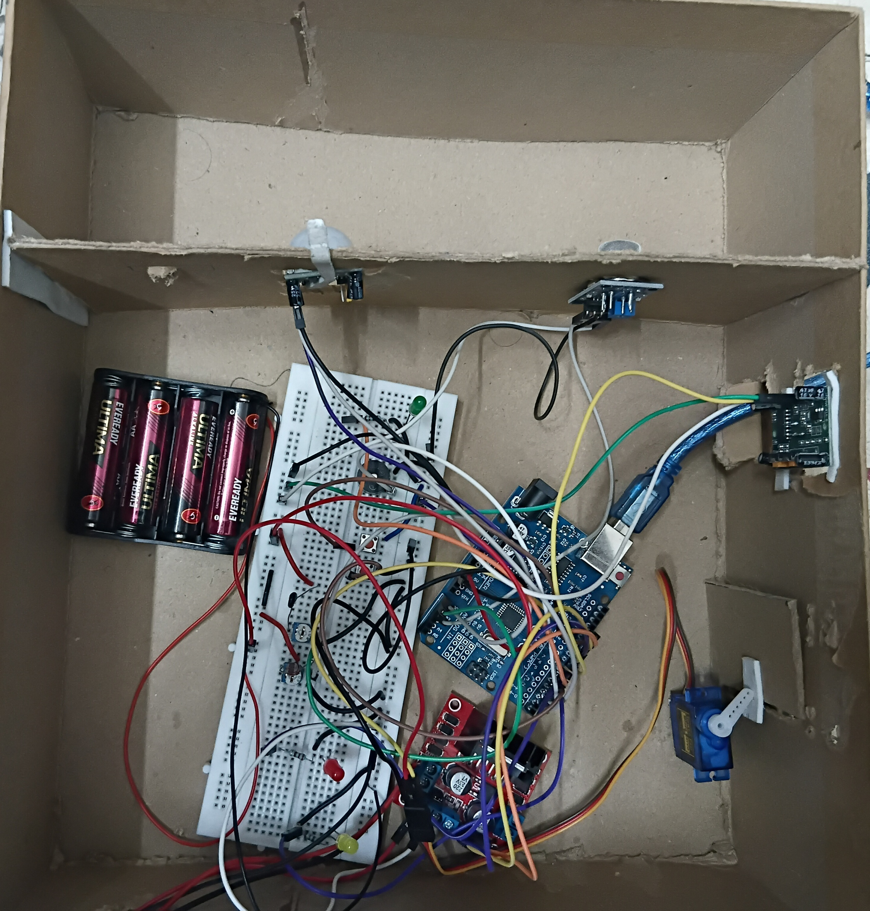

# 🏠 Smart Home Automation with Real-Time Monitoring and Actuation

## 📌 Overview

This project presents a Smart Home Automation System using Arduino that provides real-time monitoring and automatic control of home appliances. The system uses multiple sensors to monitor environmental conditions and actuates devices such as lights, fans, and doors based on sensor readings. It improves convenience, safety, and energy efficiency in a smart home environment.

---

## 🎯 Objectives

- Develop an intelligent home automation system.
- Monitor environmental conditions in real time.
- Automatically control appliances based on sensor data.
- Improve energy efficiency and user comfort.
- Demonstrate IoT-based smart home applications.

---

## 🛠️ Components Used

- Arduino Uno
- Servo Motor
- IR Sensor
- LDR Sensor
- Temperature Sensor (LM35)
- LED Indicators
- Push Buttons
- Breadboard
- Jumper Wires
- Power Supply Module
- Battery Pack
- Cardboard House Prototype

---

## ⚙️ Working Principle

The Arduino continuously monitors the connected sensors.

- The **LDR sensor** detects light intensity and automatically switches lighting.
- The **IR sensor** detects motion or object presence.
- The **Temperature sensor** monitors room temperature.
- The **Servo motor** opens or closes the door automatically.
- LEDs indicate the current status of the system.
- All monitoring and control actions occur in real time.

---

## ✨ Features

- Real-time environmental monitoring
- Automatic door control
- Intelligent lighting system
- Temperature monitoring
- Motion detection
- Low-cost implementation
- Energy-efficient operation

---

## 📷 Project Images

### Top View

### Internal Circuit Setup

![Circuit ] (Circuit setup.jpg)

### Working Model

---

## 📄 Project Report

The complete project documentation is available in **Report.pdf**.

---

## 🎓 Applications

- Smart Homes
- Home Security
- Energy Management
- Smart Buildings
- IoT Automation Systems

---

## 🚀 Future Enhancements

- Wi-Fi based remote monitoring
- Mobile application control
- Voice assistant integration
- Cloud data logging
- Fire and gas leakage detection
- Smart energy analytics

---

## 👨‍💻 Author

**Naveen Prakash R**

B.E. Electronics and Communication Engineering

GitHub: https://github.com/rnaveenprakash3bec28-arch
